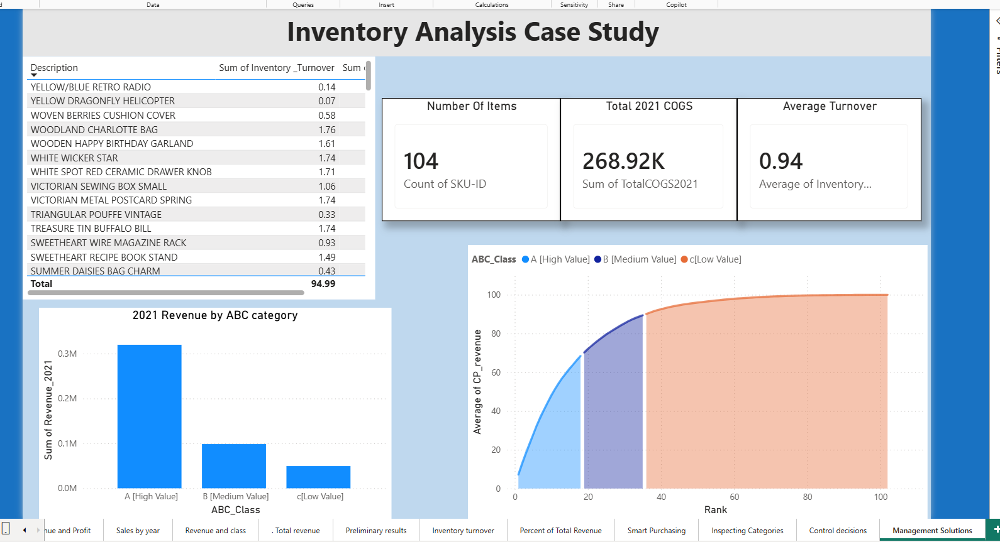
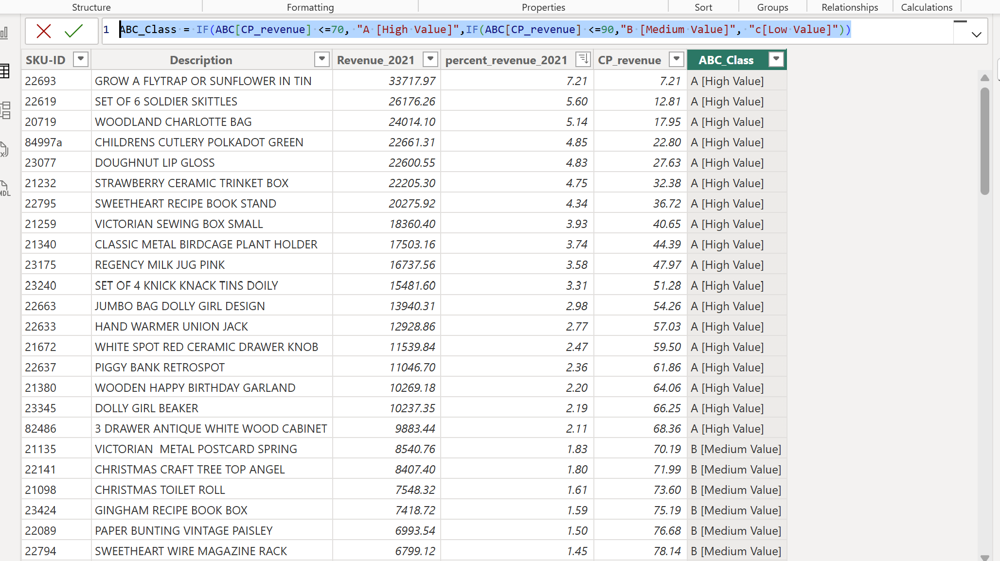
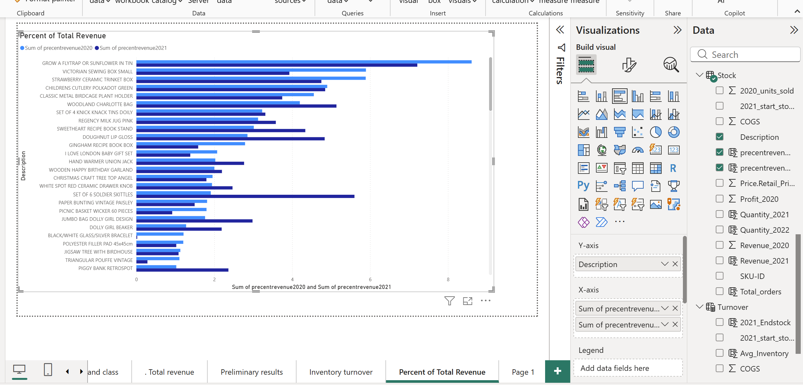
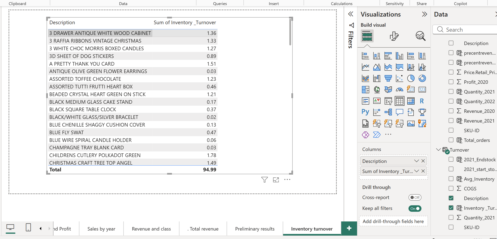

# Inventory ABC Analysis in Power BI

## Project context

Power BI analytics portfolio project completed through hands-on training using a
provided inventory case study.

## Project overview

This project examines product revenue, cost, profit, stock movement, and inventory
turnover. It applies ABC/Pareto analysis to group products into high-, medium-, and
lower-value classes so inventory attention can be prioritized.

## Business questions

- Which products contribute the largest share of revenue?
- Which products fall into Classes A, B, and C?
- How do revenue, cost, and profit vary across product categories?
- Which items have relatively high or low inventory turnover?
- Where are orders geographically concentrated?

## Tools and techniques

- Power BI Desktop
- Power Query for data preparation and table merging
- DAX calculated columns and calculated tables
- ABC/Pareto classification
- Inventory-turnover calculations
- Dashboard charts, tables, and map visuals

## What I did

- Imported and checked the Stock, Price, Categories, Costs, Orders, and Customer tables.
- Corrected headers and category labels and removed duplicate product rows.
- Merged price and cost information with the product table.
- Calculated cost of goods sold, revenue, profit, and inventory turnover.
- Ranked products by their cumulative share of revenue.
- Classified products into A, B, and C inventory groups.
- Built a dashboard covering revenue, turnover, classification, and order geography.

## Dashboard previews

### Final dashboard

### ABC classification

### Revenue contribution

### Inventory turnover

## Key findings

The completed project document records these results from the model and
interactive dashboard:

- When the dashboard was filtered to Class B (medium-value) items, the jewelry
  category no longer appeared.
- The highest-revenue Class B item had an inventory-turnover value of 1.74.
- Denmark recorded the most orders for the item selected in the document's
  country analysis.
- With Classes A and B selected together, average inventory turnover was 0.21.
- At rank 10, the cumulative percentage of 2021 revenue was 47.97%.

## Repository contents

- `images/` - selected dashboard and analysis screenshots
- `PowerBI_Inventory_ABC_Analysis.docx` - project report and analysis notes

## Files to add after verification

- `powerbi/inventory-abc-analysis.pbix` - verified Power BI project file
- `project-report.pdf` - verified PDF export of the project report

## Data and limitations

This analysis uses a provided case-study dataset. ABC thresholds are project rules,
not universal business rules. Real inventory decisions would also require current
demand, lead time, service level, and stock availability information.
